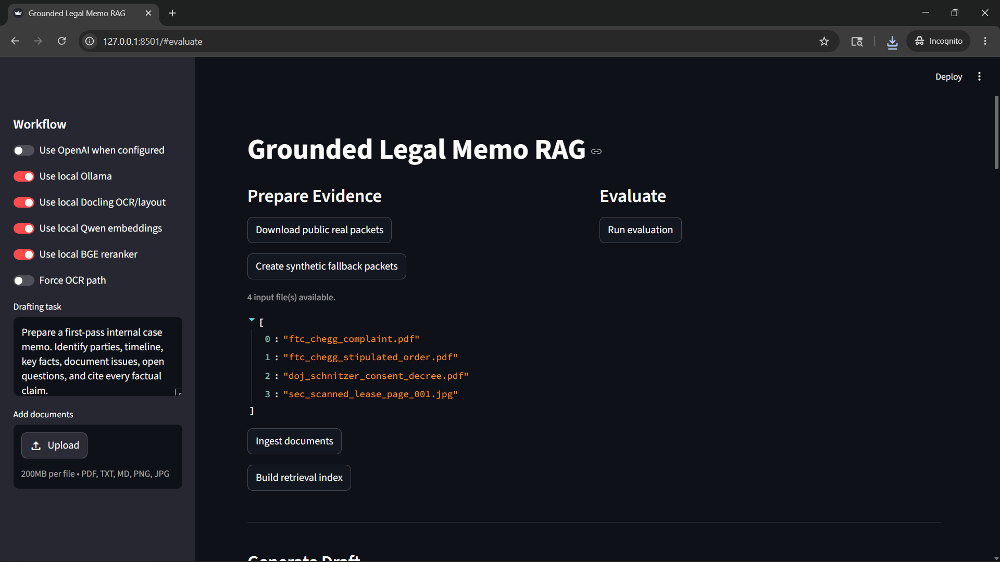
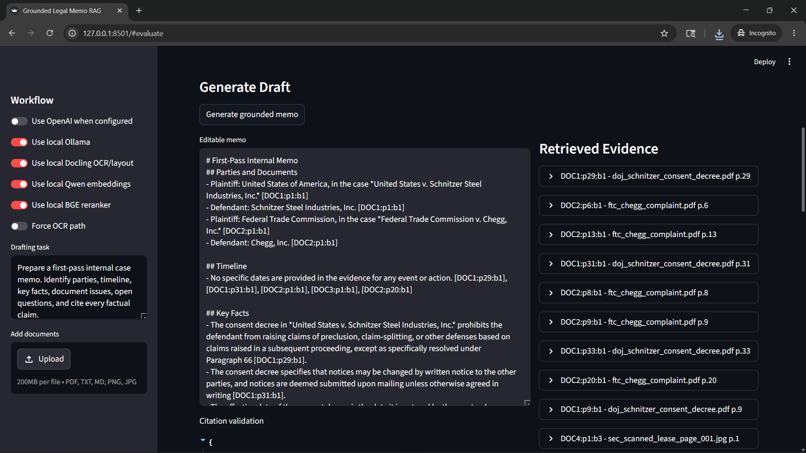
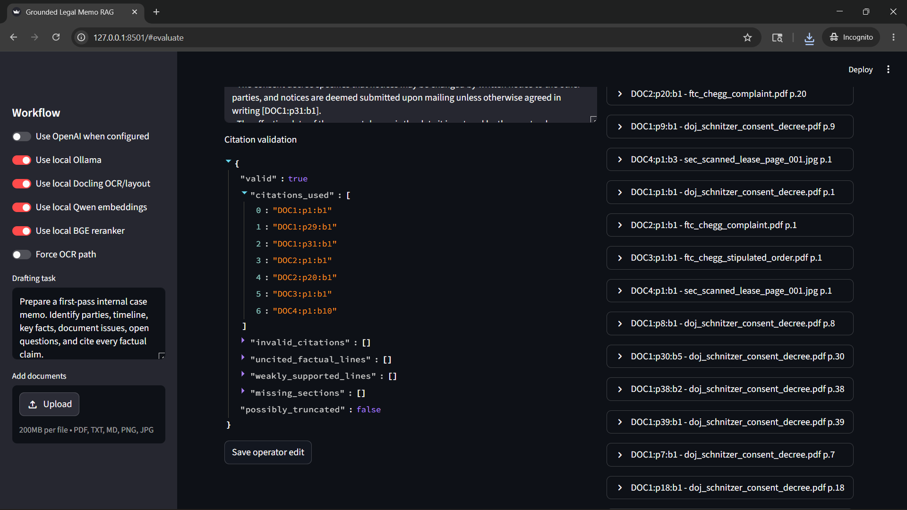
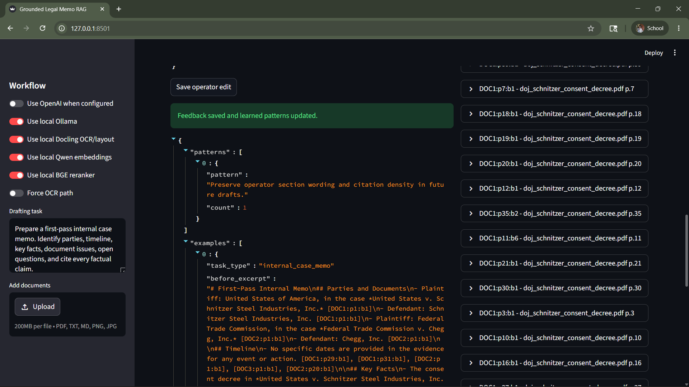
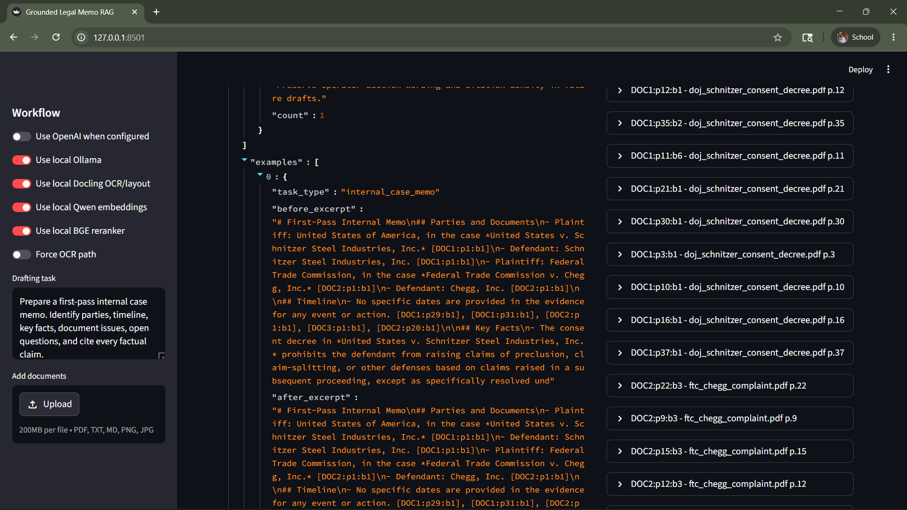
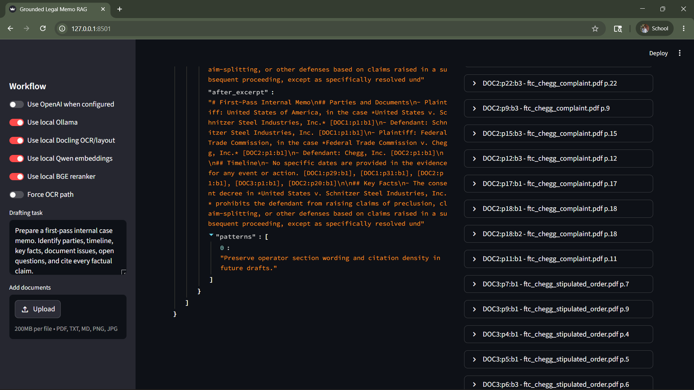

# Paralegal: Grounded Legal Memo RAG

Evidence-grounded document understanding and memo drafting for legal and regulatory materials.

This project ingests public legal documents, extracts page-level evidence, builds a hybrid retrieval index, generates a cited memo draft, captures operator edits, and evaluates retrieval plus citation grounding. It can run fully local for privacy-focused demos, while optional API providers can be enabled for stronger OCR, embeddings, and drafting quality.

## Screenshots

### Core Workflow







### Operator Edit Learning







## Features

- Document ingestion for PDFs, text, markdown, PNG, JPG, and JPEG files.
- Native PDF text extraction before OCR, so clean PDFs are processed quickly.
- Optional OCR/layout parsing with Mistral OCR or local Docling.
- Normalized evidence records with stable source ids such as `DOC2:p6:b1`.
- Structured extraction for parties, dates, addresses, amounts, signatures, deadlines, and unclear spans.
- Hybrid retrieval with SQLite FTS5 keyword search, vector search, reciprocal-rank fusion, and optional reranking.
- Local embedding support with `Qwen/Qwen3-Embedding-0.6B`.
- Local reranking support with `BAAI/bge-reranker-base`.
- Local drafting through Ollama, defaulting to `qwen3:4b-instruct`.
- Optional OpenAI-backed drafting, structured extraction, edit analysis, and embeddings.
- Citation validation to reject unsupported memo claims.
- Operator edit capture and reusable preference learning.
- Streamlit UI for ingesting documents, generating drafts, inspecting evidence, saving edits, and running evaluation.

## Architecture

```text
documents / uploads
        |
        v
ingestion.py
  native PDF text -> optional OCR/layout -> normalized evidence blocks
  structured field extraction
        |
        v
data/processed/processed_documents.jsonl
data/processed/document_summaries.json
        |
        v
retrieval.py
  SQLite FTS5 + embeddings + RRF + optional reranker
        |
        v
generation.py
  retrieved evidence + learned edit patterns -> cited memo draft
        |
        v
feedback.py / evaluation.py
  edit learning, citation checks, retrieval metrics, report output
```

## Quick Start

Create a virtual environment and install dependencies:

```powershell
python -m venv venv
venv\Scripts\python.exe -m pip install -r requirements.txt
```

Run the complete pipeline with public sample documents:

```powershell
venv\Scripts\python.exe -m legal_rag.cli all
```

Open the UI:

```powershell
venv\Scripts\streamlit.exe run app.py
```

Then visit `http://localhost:8501`.

Generated artifacts are written to:

- `data/processed/processed_documents.jsonl`
- `evidence_index/evidence.sqlite`
- `sample_outputs/generated_memo.md`
- `sample_outputs/evidence_map.json`
- `sample_outputs/evaluation_report.md`

Check the local environment:

```powershell
venv\Scripts\python.exe -m legal_rag.cli doctor
```

## Local WSL Mode

For local-model runs on WSL Ubuntu:

```bash
cd /mnt/f/paralegal
bash scripts/setup_wsl_local.sh
source localenv/bin/activate
ollama pull qwen3:4b-instruct
bash scripts/run_wsl_local.sh
```

Launch the UI from WSL:

```bash
bash scripts/run_wsl_ui.sh
```

The WSL UI script disables Streamlit file watching, which avoids common hangs when serving a project from a Windows-mounted `/mnt/*` path.

The local WSL stack uses:

- OCR/layout: Docling.
- Embeddings: `Qwen/Qwen3-Embedding-0.6B`.
- Reranking: `BAAI/bge-reranker-base`.
- Drafting: Ollama with `qwen3:4b-instruct`.

Hardware selection is automatic. By default, the WSL runner uses CUDA only when PyTorch can see a supported NVIDIA GPU with compute capability `sm_75` or newer. Older or unsupported GPUs fall back to CPU instead of failing during OCR, embedding, or reranking. Set `LOCAL_ACCELERATOR=cpu` to force CPU or `LOCAL_ACCELERATOR=cuda` to force CUDA.

## Optional API Providers

Copy the example environment file and add the keys you want to use:

```powershell
copy .env.example .env
```

Common settings:

| Variable | Purpose |
| --- | --- |
| `OPENAI_API_KEY` | Enables OpenAI drafting, structured extraction, edit analysis, and embeddings. |
| `MISTRAL_API_KEY` | Enables Mistral OCR for scanned or image-heavy documents. |
| `OPENAI_DRAFT_MODEL` | Drafting model used when OpenAI generation is enabled. |
| `OPENAI_EMBEDDING_MODEL` | Embedding model used when OpenAI embeddings are enabled. |
| `MISTRAL_OCR_MODEL` | OCR model used by the Mistral provider. |
| `OLLAMA_BASE_URL` | Ollama server URL for local drafting. |
| `OLLAMA_MODEL` | Local Ollama model name. |
| `LOCAL_ACCELERATOR` | `auto`, `cpu`, or `cuda` for local OCR, embeddings, and reranking. |
| `LOCAL_CUDA_MIN_CAPABILITY` | Minimum CUDA compute capability accepted by the auto detector. |

External services are optional. Without keys, the project uses local extraction, hashing embeddings or local embedding models depending on command flags, and a deterministic memo fallback when no LLM is available.

## CLI Commands

Download or create inputs:

```powershell
venv\Scripts\python.exe -m legal_rag.cli download-real --out sample_inputs
venv\Scripts\python.exe -m legal_rag.cli make-samples --out sample_inputs
```

Run each stage separately:

```powershell
venv\Scripts\python.exe -m legal_rag.cli ingest sample_inputs --out data/processed
venv\Scripts\python.exe -m legal_rag.cli index --processed data/processed/processed_documents.jsonl --index evidence_index
venv\Scripts\python.exe -m legal_rag.cli draft --index evidence_index --processed data/processed --feedback data/feedback --out sample_outputs
venv\Scripts\python.exe -m legal_rag.cli evaluate --index evidence_index --processed data/processed --truth sample_inputs/sample_ground_truth.json --feedback data/feedback --out sample_outputs
```

Run the local-model stack from an activated WSL environment:

```bash
python -m legal_rag.cli all \
  --ocr-backend docling \
  --embedding-backend local \
  --reranker-backend local \
  --use-ollama
```

Useful flags:

- `--use-openai`: allow API-backed generation or evaluation when keys are configured.
- `--use-ollama`: draft with the configured local Ollama model.
- `--ocr-backend docling`: use local Docling OCR/layout parsing.
- `--ocr-backend mistral`: use Mistral OCR when `MISTRAL_API_KEY` is set.
- `--embedding-backend local`: use the configured local Sentence Transformers embedding model.
- `--embedding-backend hashing`: use deterministic local hashing embeddings.
- `--reranker-backend local`: use the configured local BGE reranker.
- `--synthetic`: use generated synthetic inputs instead of downloaded public documents.

## Evaluation

The included evaluation checks:

- Retrieval term recall at 5.
- Source recall at 5.
- Mean reciprocal rank.
- Extracted field counts.
- Extraction warnings.
- Citation validity.
- Missing or unsupported factual lines.
- Edit-learning persistence.

Current sample output:

| Metric | Value |
| --- | ---: |
| Documents processed | 4 |
| Evidence blocks indexed | 141 |
| Mean term recall@5 | 0.67 |
| Mean source recall@5 | 1.00 |
| Mean reciprocal rank | 0.88 |
| Citation validation | Passed |
| Unsupported factual lines | 0 |

See `sample_outputs/evaluation_report.md` and `sample_outputs/evaluation_report.json` for the full report.

## Data Sources

The public sample workflow downloads legal and regulatory documents from:

- FTC Chegg case documents: https://www.ftc.gov/legal-library/browse/cases-proceedings/chegg-inc
- DOJ Schnitzer consent decree source: https://www.justice.gov/archives/opa/pr/schnitzer-steel-industries-inc-pay-155-million-penalty-and-perform-comprehensive
- SEC EDGAR exhibit source: https://www.sec.gov/Archives/edgar/data/1307579/000107878211003292/

The project also includes synthetic sample generation for offline testing.

## Privacy Notes

The local WSL mode keeps document processing, embeddings, reranking, and drafting on the machine. API-backed providers are opt-in and should be enabled only when the documents are allowed to leave the local environment under the applicable data handling policy.

For production legal workflows, treat this project as a reference implementation. Add access control, audit logging, encryption, data retention controls, provider contracts, human review gates, and matter-level permissioning before handling confidential client material.

## Project Structure

```text
app.py                         Streamlit UI
legal_rag/
  cli.py                       Command-line entry point
  ingestion.py                 Document extraction and OCR orchestration
  retrieval.py                 SQLite FTS5, embeddings, RRF, reranking
  generation.py                Evidence-grounded memo generation
  feedback.py                  Operator edit capture and pattern learning
  evaluation.py                Retrieval, extraction, and grounding reports
  providers.py                 OpenAI, Mistral, Ollama, embedding, reranker providers
  local_device.py              Local CPU/CUDA device selection
scripts/
  setup_wsl_local.sh           WSL local environment setup
  run_wsl_local.sh             Local WSL pipeline runner
  run_wsl_ui.sh                Streamlit launcher for WSL
sample_inputs/                 Public or synthetic input documents
sample_outputs/                Generated memo, evidence map, evaluation reports
docs/assets/                   README screenshots
tests/                         Unit tests
```

See [docs/developer-guide.md](docs/developer-guide.md) for module responsibilities, data boundaries, provider behavior, grounding rules, and verification commands.

See [docs/technical-report.md](docs/technical-report.md) or [docs/technical-report.pdf](docs/technical-report.pdf) for the architecture narrative, assumptions, tradeoffs, sample outputs, evaluation approach, and production path.

## Limitations

- This is not legal advice.
- Generated drafts require attorney or domain-expert review before use.
- OCR quality varies by scan quality, handwriting, layout complexity, and selected backend.
- Local CPU inference is usable for demos but can be slow on large document sets.
- The deterministic fallback memo is designed for reliability, not writing quality.
- The included evaluation set is small and intended to make system behavior inspectable.

## Related References

- Mistral OCR API: https://docs.mistral.ai/api/endpoint/ocr
- OpenAI structured outputs: https://platform.openai.com/docs/guides/structured-outputs
- Hybrid sparse+dense retrieval and reranking: https://qdrant.tech/documentation/tutorials-search-engineering/reranking-hybrid-search/
- RAG evaluation concepts: https://docs.ragas.io/en/stable/concepts/metrics/
